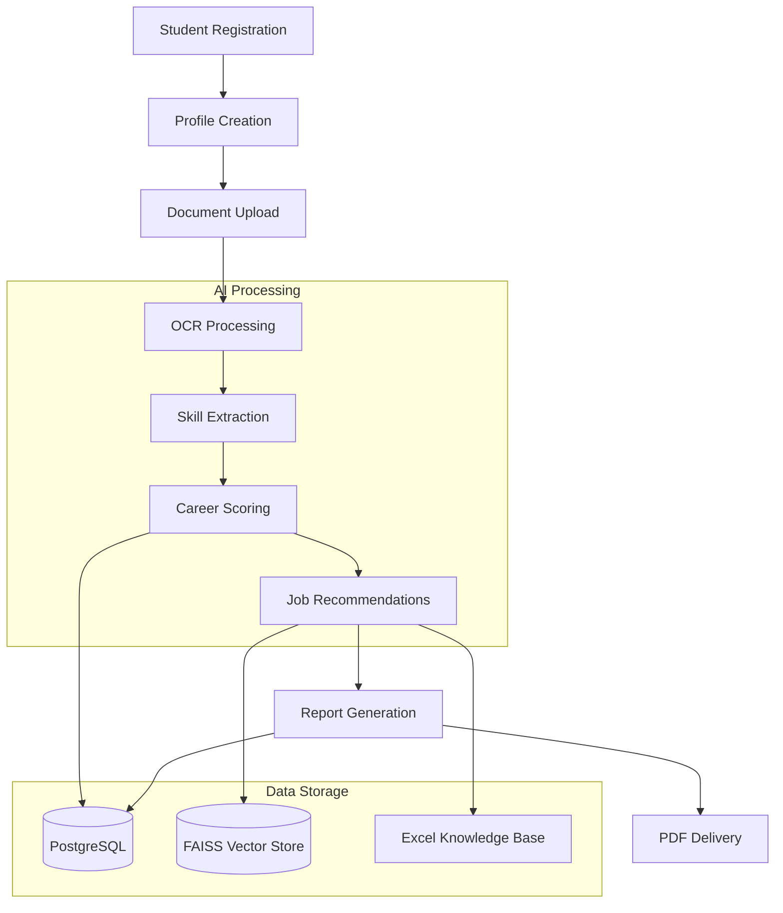
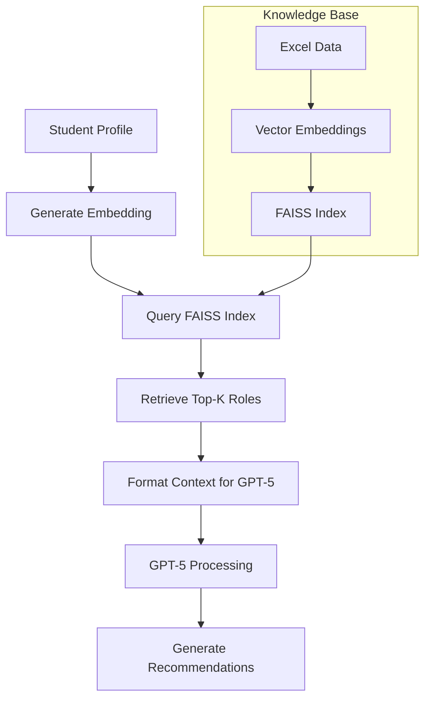
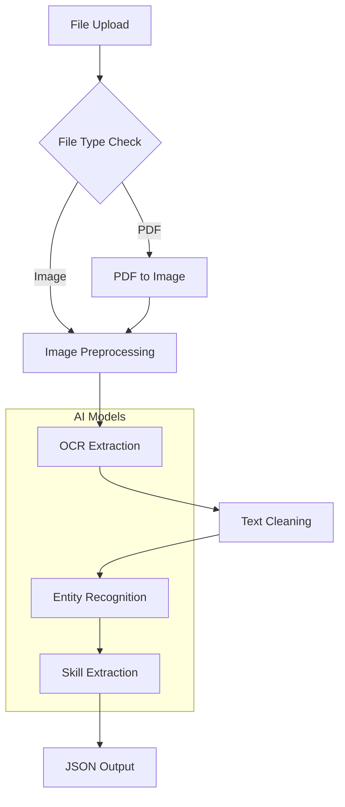

# 🔧 Technical Implementation Guide
## AI-Powered Student Career Intelligence & Guidance System

---

## 1. Development Phases Overview

### Phase 1: Foundation (Week 1-2)
- Project setup and environment configuration
- Database schema implementation
- Basic API structure with FastAPI
- Frontend React application setup

### Phase 2: Core Modules (Week 3-4)
- Student Profile Analyzer implementation
- Document upload and storage system
- Basic authentication and user management

### Phase 3: Document Intelligence (Week 5-6)
- OCR integration with Tesseract/Google Vision
- Document type detection and validation
- Text extraction and preprocessing

### Phase 4: AI Integration (Week 7-8)
- GPT-5 API integration
- Career Readiness Scoring algorithm
- Knowledge Base Excel processing

### Phase 5: RAG System (Week 9-10)
- Vector embedding generation with Sentence-BERT
- FAISS vector store implementation
- Similarity search and retrieval

### Phase 6: Report Generation (Week 11-12)
- PDF report template design
- Data visualization integration
- Report delivery system

---

## 2. Module Specifications

### 2.1 Student Profile Analyzer Module

**Purpose**: Collect and manage student profile data with document uploads

**Components**:
- Profile form with validation
- Multi-file upload interface
- Document preview and management
- Profile data storage and retrieval

**Technical Stack**:
- Frontend: React Hook Form + React Dropzone
- Backend: FastAPI with Pydantic models
- Storage: Local filesystem (dev) / AWS S3 (prod)

**Data Flow**:
```
Student Form → Validation → File Upload → Storage → Database → Confirmation
```

**Key Features**:
- Real-time form validation
- Drag-and-drop file upload
- Progress indicators for uploads
- File type and size validation
- Profile completeness tracking

### 2.2 Document Intelligence Engine

**Purpose**: Extract text and skills from uploaded certificates and documents

**Components**:
- File type detection (PDF, JPG, PNG, etc.)
- OCR text extraction
- Text preprocessing and cleaning
- Skill entity extraction using GPT-5-mini

**Technical Stack**:
- OCR: Tesseract OCR (local) / Google Vision API (cloud)
- NLP: GPT-5-mini for skill extraction
- Processing: Python with OpenCV for image preprocessing

**Processing Pipeline**:
```
File Upload → Type Detection → Image Preprocessing → OCR → Text Cleaning → Skill Extraction → JSON Output
```

**Output Format**:
```json
{
  "document_id": "uuid",
  "extracted_text": "full text content",
  "certificates": [
    {
      "name": "Course Name",
      "provider": "Organization",
      "skills": ["skill1", "skill2"],
      "confidence": 0.95
    }
  ],
  "processing_time": 2.5,
  "ocr_confidence": 0.89
}
```

### 2.3 Career Intelligence Engine (CIE)

**Purpose**: Core AI engine for career analysis and recommendations

**Components**:
- Profile and skill fusion
- Career Readiness Score calculation
- Skill gap identification
- Job role recommendation using RAG

**AI Models**:
- GPT-5 for reasoning and recommendations
- Sentence-BERT for embeddings
- FAISS for vector similarity search

**Scoring Algorithm Implementation**:
```python
class CareerReadinessScorer:
    def calculate_score(self, student_profile, extracted_skills):
        # Step 1: Calculate core metrics
        D = self.calculate_degree_score(student_profile)
        E = self.calculate_experience_score(student_profile)
        CSC = self.calculate_skill_coverage(student_profile, extracted_skills)
        CQ = self.calculate_certificate_quality(extracted_skills)
        P = self.calculate_practical_evidence(extracted_skills)
        SS = self.calculate_soft_skills(student_profile)
        
        # Step 2: Market factors
        RD = self.get_role_demand(extracted_skills)
        SF = self.get_salary_fit(student_profile, extracted_skills)
        RDf = self.get_role_difficulty(extracted_skills)
        
        # Step 3: Confidence factors
        EC = self.get_evidence_confidence(extracted_skills)
        DC = self.get_data_completeness(student_profile)
        
        # Final calculation
        raw_score = (0.12 * D) + (0.08 * E) + (0.30 * CSC) + (0.15 * CQ) + (0.10 * P) + (0.05 * SS)
        market_factor = (0.6 * RD) + (0.2 * SF) + (0.2 * (1 - RDf))
        meta_factor = (0.8 * EC) + (0.2 * DC)
        
        final_score = round(100 * raw_score * market_factor * meta_factor)
        
        return {
            "score": final_score,
            "breakdown": {
                "degree_score": D,
                "experience_score": E,
                "skill_coverage": CSC,
                "certificate_quality": CQ,
                "practical_evidence": P,
                "soft_skills": SS
            },
            "confidence": meta_factor
        }
```

### 2.4 Knowledge Base Management

**Purpose**: Manage and query the Excel-based job role knowledge base

**Components**:
- Excel file parsing and validation
- Vector embedding generation
- FAISS index management
- Role similarity search

**Data Schema**:
```json
{
  "cluster": "Technology",
  "job_family": "Software Development",
  "job_role": "Full Stack Developer",
  "level": "Entry",
  "qualifications": ["B.Tech", "B.E.", "MCA"],
  "technical_skills": ["JavaScript", "React", "Node.js", "MongoDB"],
  "soft_skills": ["Communication", "Problem Solving"],
  "domain_skills": ["Web Development", "REST APIs"],
  "experience_range": "0-2 years",
  "job_index": "15-1254.00",
  "description": "Develops web applications using modern frameworks",
  "average_salary": {"india": "8-12 LPA", "global": "$60k-80k"},
  "sources": ["https://onetonline.org/link/15-1254.00"]
}
```

---

## 3. API Endpoint Specifications

### 3.1 Authentication Endpoints

| Endpoint | Method | Description | Request | Response |
|----------|---------|-------------|---------|----------|
| `/api/auth/register` | POST | Student registration | `{email, password, name}` | `{user_id, token}` |
| `/api/auth/login` | POST | Student login | `{email, password}` | `{user_id, token}` |
| `/api/auth/logout` | POST | Student logout | `{token}` | `{success: true}` |

### 3.2 Student Profile Endpoints

| Endpoint | Method | Description | Request | Response |
|----------|---------|-------------|---------|----------|
| `/api/student/profile` | POST | Create student profile | Profile JSON | `{profile_id}` |
| `/api/student/profile/{id}` | GET | Get student profile | - | Profile JSON |
| `/api/student/profile/{id}` | PUT | Update student profile | Profile JSON | `{updated: true}` |
| `/api/student/profile/{id}/documents` | POST | Upload documents | FormData | `{document_ids}` |

### 3.3 Document Processing Endpoints

| Endpoint | Method | Description | Request | Response |
|----------|---------|-------------|---------|----------|
| `/api/documents/analyze` | POST | Analyze uploaded documents | `{document_ids}` | `{analysis_id, status}` |
| `/api/documents/analysis/{id}` | GET | Get analysis results | - | Analysis JSON |
| `/api/documents/extract-skills` | POST | Extract skills from documents | `{document_ids}` | `{skills, confidence}` |

### 3.4 Career Intelligence Endpoints

| Endpoint | Method | Description | Request | Response |
|----------|---------|-------------|---------|----------|
| `/api/career/calculate-score` | POST | Calculate career readiness score | `{profile_id, skills}` | Score JSON |
| `/api/career/recommendations` | POST | Get job recommendations | `{profile_id, score}` | Recommendations JSON |
| `/api/career/skill-gaps` | POST | Identify skill gaps | `{profile_id, target_roles}` | Skill gaps JSON |

### 3.5 Report Generation Endpoints

| Endpoint | Method | Description | Request | Response |
|----------|---------|-------------|---------|----------|
| `/api/reports/generate` | POST | Generate career report | `{profile_id}` | `{report_id, status}` |
| `/api/reports/{id}` | GET | Get report status/URL | - | Report JSON |
| `/api/reports/{id}/download` | GET | Download report PDF | - | PDF file |

### 3.6 Knowledge Base Endpoints

| Endpoint | Method | Description | Request | Response |
|----------|---------|-------------|---------|----------|
| `/api/kb/upload` | POST | Upload Excel KB | FormData | `{upload_id}` |
| `/api/kb/refresh` | POST | Refresh vector embeddings | - | `{refreshed: true}` |
| `/api/kb/search` | POST | Search job roles | `{query, limit}` | Role matches |

---

## 4. Database Schema Design

### 4.1 PostgreSQL Schema (Primary Database)

```sql
-- Users table
CREATE TABLE users (
    id UUID PRIMARY KEY DEFAULT gen_random_uuid(),
    email VARCHAR(255) UNIQUE NOT NULL,
    password_hash VARCHAR(255) NOT NULL,
    name VARCHAR(100) NOT NULL,
    created_at TIMESTAMP DEFAULT NOW(),
    updated_at TIMESTAMP DEFAULT NOW()
);

-- Student profiles table
CREATE TABLE student_profiles (
    id UUID PRIMARY KEY DEFAULT gen_random_uuid(),
    user_id UUID REFERENCES users(id),
    name VARCHAR(100) NOT NULL,
    email VARCHAR(255) NOT NULL,
    degree VARCHAR(100),
    specialization VARCHAR(100),
    school_marks FLOAT,
    ug_marks FLOAT,
    pg_marks FLOAT,
    experience_years FLOAT DEFAULT 0,
    interests TEXT[],
    soft_skills TEXT[],
    target_salary FLOAT,
    created_at TIMESTAMP DEFAULT NOW(),
    updated_at TIMESTAMP DEFAULT NOW()
);

-- Documents table
CREATE TABLE documents (
    id UUID PRIMARY KEY DEFAULT gen_random_uuid(),
    student_id UUID REFERENCES student_profiles(id),
    filename VARCHAR(255) NOT NULL,
    file_path VARCHAR(500) NOT NULL,
    file_type VARCHAR(50),
    file_size BIGINT,
    uploaded_at TIMESTAMP DEFAULT NOW(),
    processing_status VARCHAR(50) DEFAULT 'pending'
);

-- Extracted certificates table
CREATE TABLE extracted_certificates (
    id UUID PRIMARY KEY DEFAULT gen_random_uuid(),
    document_id UUID REFERENCES documents(id),
    certificate_name VARCHAR(255),
    provider VARCHAR(255),
    issue_date DATE,
    skills TEXT[],
    ocr_confidence FLOAT,
    extracted_at TIMESTAMP DEFAULT NOW()
);

-- Career readiness scores table
CREATE TABLE career_scores (
    id UUID PRIMARY KEY DEFAULT gen_random_uuid(),
    student_id UUID REFERENCES student_profiles(id),
    total_score INTEGER,
    degree_score FLOAT,
    experience_score FLOAT,
    skill_coverage_score FLOAT,
    certificate_quality_score FLOAT,
    practical_evidence_score FLOAT,
    soft_skills_score FLOAT,
    confidence FLOAT,
    calculated_at TIMESTAMP DEFAULT NOW()
);

-- Job recommendations table
CREATE TABLE job_recommendations (
    id UUID PRIMARY KEY DEFAULT gen_random_uuid(),
    student_id UUID REFERENCES student_profiles(id),
    job_role VARCHAR(255),
    job_family VARCHAR(255),
    cluster VARCHAR(100),
    match_score FLOAT,
    missing_skills TEXT[],
    salary_range VARCHAR(100),
    confidence FLOAT,
    recommended_at TIMESTAMP DEFAULT NOW()
);

-- Reports table
CREATE TABLE reports (
    id UUID PRIMARY KEY DEFAULT gen_random_uuid(),
    student_id UUID REFERENCES student_profiles(id),
    report_path VARCHAR(500),
    generated_at TIMESTAMP DEFAULT NOW(),
    file_size BIGINT,
    status VARCHAR(50) DEFAULT 'generating'
);
```

### 4.2 MongoDB Schema (Alternative for Document Storage)

```javascript
// Student profile collection
{
  _id: ObjectId,
  user_id: UUID,
  personal_info: {
    name: String,
    email: String,
    phone: String
  },
  education: {
    degree: String,
    specialization: String,
    marks: {
      school: Number,
      ug: Number,
      pg: Number
    },
    institution: String,
    graduation_year: Number
  },
  experience: {
    years: Number,
    details: [{
      company: String,
      role: String,
      duration: String,
      skills_gained: [String]
    }]
  },
  skills: {
    technical: [String],
    soft: [String],
    interests: [String]
  },
  career_preferences: {
    target_salary: Number,
    preferred_locations: [String],
    job_types: [String]
  },
  documents: [{
    document_id: UUID,
    type: String,
    name: String,
    upload_date: Date
  }],
  created_at: Date,
  updated_at: Date
}

// Document analysis results
{
  _id: ObjectId,
  student_id: UUID,
  document_id: UUID,
  analysis_results: {
    extracted_text: String,
    certificates: [{
      name: String,
      provider: String,
      issue_date: Date,
      skills: [String],
      confidence: Number
    }],
    skills_summary: String,
    processing_time: Number
  },
  ocr_confidence: Number,
  analyzed_at: Date
}
```

---

## 5. Integration Flow Diagrams

### 5.1 Overall System Flow



### 5.2 RAG Implementation Flow



### 5.3 Document Processing Pipeline



---

## 6. Development Priority Matrix

### Priority 1: Critical (Must Have)
- [ ] Student registration and authentication
- [ ] Basic profile creation and management
- [ ] File upload and storage system
- [ ] Basic OCR text extraction
- [ ] Career readiness scoring algorithm
- [ ] PDF report generation

### Priority 2: Important (Should Have)
- [ ] Advanced OCR with confidence scoring
- [ ] GPT-5 integration for skill extraction
- [ ] Knowledge Base Excel processing
- [ ] Vector embedding generation
- [ ] FAISS similarity search
- [ ] Job recommendation system

### Priority 3: Nice to Have
- [ ] Advanced image preprocessing
- [ ] Multi-language OCR support
- [ ] Advanced report templates
- [ ] Real-time processing status
- [ ] Batch processing capabilities
- [ ] Advanced analytics dashboard

### Priority 4: Future Enhancements
- [ ] AI chat career advisor
- [ ] Automated KB updates
- [ ] Resume parsing module
- [ ] Placement prediction
- [ ] Multi-institution support
- [ ] Mobile application

---

## 7. Testing Strategy

### 7.1 Unit Testing
- **Backend**: Pytest for Python services
- **Frontend**: Jest for React components
- **Coverage Target**: 80% code coverage

### 7.2 Integration Testing
- API endpoint testing with Postman/newman
- Database integration tests
- File upload/download tests
- OCR accuracy tests

### 7.3 Performance Testing
- Load testing with Apache JMeter
- Concurrent user testing (target: 1000 users)
- Response time benchmarks (< 2s for scoring)
- Memory usage optimization

### 7.4 AI Model Testing
- OCR accuracy validation (target: 95%+)
- Skill extraction validation
- Recommendation relevance testing
- Bias detection and mitigation

### 7.5 Security Testing
- Authentication and authorization tests
- File upload security validation
- SQL injection prevention
- XSS protection validation

---

## 8. Deployment Architecture

### 8.1 Development Environment
```yaml
# docker-compose.yml
version: '3.8'
services:
  backend:
    build: ./backend
    ports:
      - "8000:8000"
    environment:
      - DATABASE_URL=postgresql://user:pass@db:5432/career_db
      - GPT5_API_KEY=${GPT5_API_KEY}
    depends_on:
      - db
      - redis
  
  frontend:
    build: ./frontend
    ports:
      - "3000:3000"
    environment:
      - REACT_APP_API_URL=http://localhost:8000
  
  db:
    image: postgres:14
    environment:
      - POSTGRES_DB=career_db
      - POSTGRES_USER=user
      - POSTGRES_PASSWORD=pass
    volumes:
      - postgres_data:/var/lib/postgresql/data
  
  redis:
    image: redis:7-alpine
    ports:
      - "6379:6379"
```

### 8.2 Production Environment
- **Backend**: AWS ECS / Kubernetes
- **Frontend**: AWS S3 + CloudFront
- **Database**: AWS RDS PostgreSQL
- **File Storage**: AWS S3
- **Caching**: AWS ElastiCache (Redis)
- **CDN**: AWS CloudFront
- **Monitoring**: AWS CloudWatch

---

## 9. Monitoring and Logging

### 9.1 Application Monitoring
- Response time tracking
- Error rate monitoring
- API usage analytics
- User behavior tracking

### 9.2 AI Model Monitoring
- OCR confidence scores
- GPT-5 response quality
- Recommendation accuracy
- Processing time metrics

### 9.3 Infrastructure Monitoring
- Server resource usage
- Database performance
- File storage metrics
- Network latency

### 9.4 Logging Strategy
- Structured JSON logging
- Log levels (ERROR, WARN, INFO, DEBUG)
- Centralized log aggregation
- Log retention policies (30 days)

---

## 10. Success Metrics and KPIs

### 10.1 Technical Metrics
- **API Response Time**: < 2 seconds (95th percentile)
- **System Availability**: 99.9% uptime
- **OCR Accuracy**: > 95% for clear documents
- **Processing Time**: < 30 seconds per document
- **Concurrent Users**: Support 1000+ simultaneous users

### 10.2 Business Metrics
- **User Registration Rate**: 100+ new users/day
- **Document Upload Success**: > 98% success rate
- **Report Generation**: < 5 minutes from upload
- **User Satisfaction**: > 4.5/5 rating
- **Recommendation Accuracy**: > 90% relevant suggestions

### 10.3 AI Model Performance
- **Skill Extraction Precision**: > 85%
- **Recommendation Relevance**: > 90%
- **Score Consistency**: < 10% variance
- **Hallucination Rate**: < 5%
- **Citation Accuracy**: 100% traceable sources

---

This technical implementation guide provides a comprehensive roadmap for building the AI-Powered Student Career Intelligence & Guidance System. Follow the phases systematically, prioritize critical features, and maintain high standards for code quality and user experience.